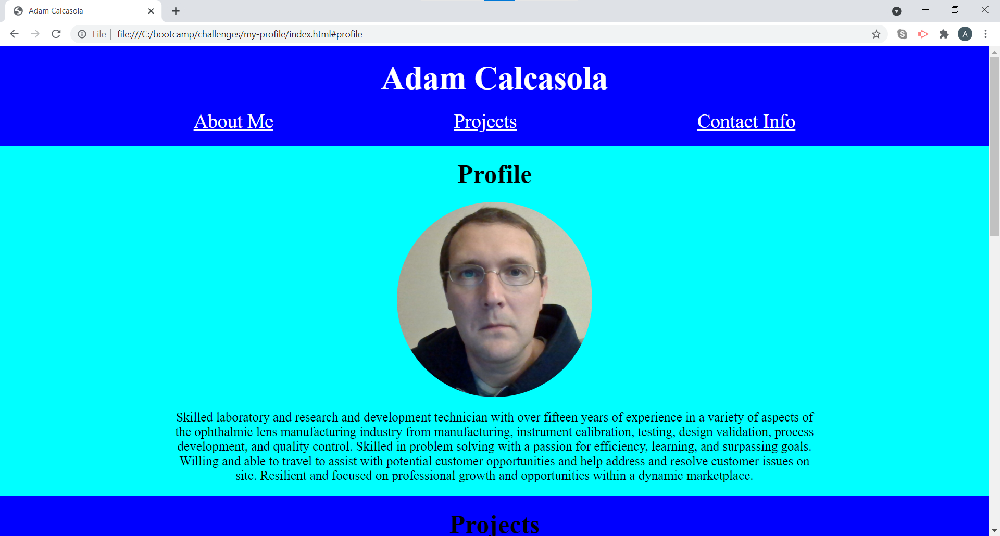

## Challenge 2 - My Profile 1.0.0

# Description
* This web page displays a portfolio summary of my recent work in the Uconn Coding Bootcamp.

# Features
* It includes a navigation bar to jump to three different sections of the page.
* The first section includes a photograph of me and a brief executive summary.
* The second section includes screenshots of my recent work that will navigate to each site when clicked on.
* The third section includes my contact information including my cell phone number, email, Linkedin page, and Github page.
* The displayed email, Linkedin, and Github navigates to the relevent page.

https://adamcalcasola.github.io/my-profile/

